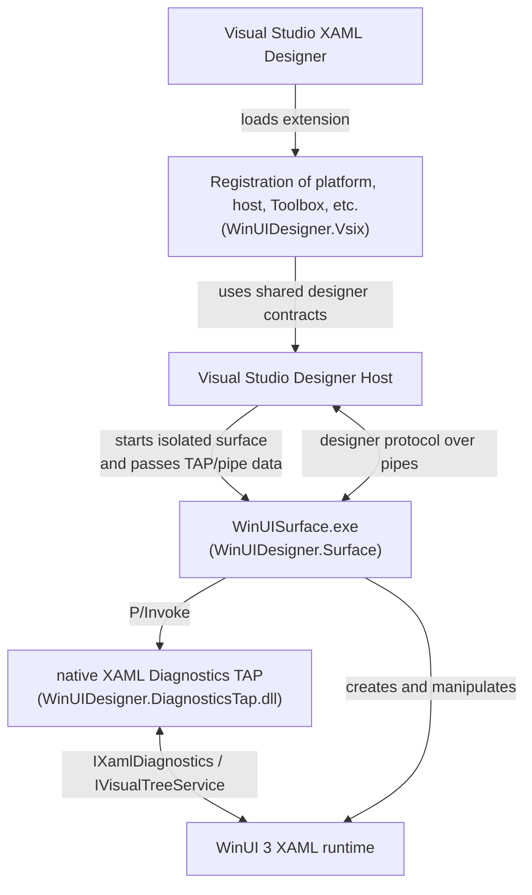

<h1 align="center">WinUI 3 Designer for Visual Studio</h1>

WinUI 3 designer integration for Visual Studio.

## Usage

Download and open a vsix file from Visual Studio Marketplace. WinUI 3 designer will be automatically available for WinUI 3 projects.

## Architecture

**`WinUIDesigner.DiagnosticsTap`**

A native x64 DLL loaded by the isolated WinUI surface process. It attaches to WinUI XAML Diagnostics, exposes property-value-source queries and rendering control to the managed surface, and implements the diagnostics TAP COM entry points.

**`WinUIDesigner.Surface`**

The out-of-process WinUI 3 designer surface, published as the self-contained `WinUISurface.exe`. It connects to Visual Studio through the designer's TAP/pipe contracts, builds and updates the XAML document, and handles designer operations such as selection, hit testing, property values, and layout. It calls `WinUIDesigner.DiagnosticsTap.dll` for native XAML diagnostics that are not exposed by the public WinUI API.

**`WinUIDesigner.Vsix`**

The in-process Visual Studio extension. It registers the WinUI XAML runtime, selects the WinUI platform implementation, reuses Visual Studio's designer host and process-isolation services, stages and launches `WinUISurface.exe`, and provides Toolbox integration and logging.

