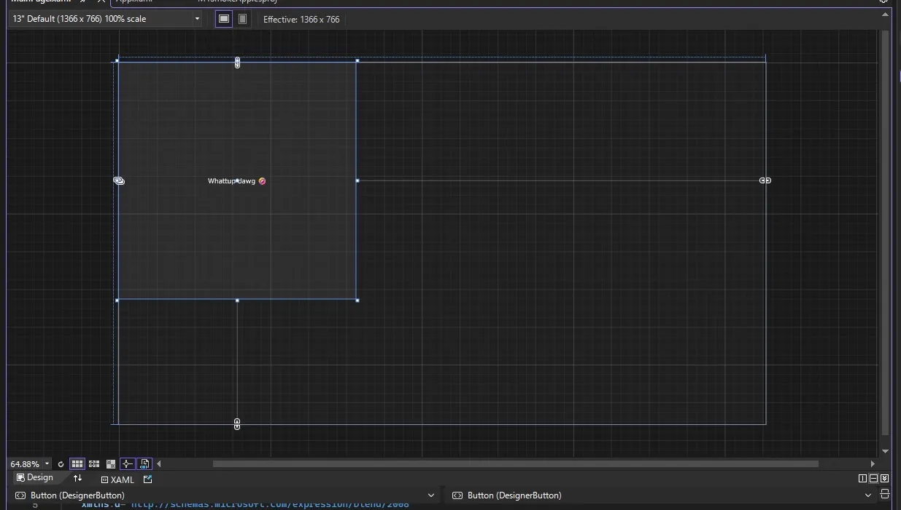
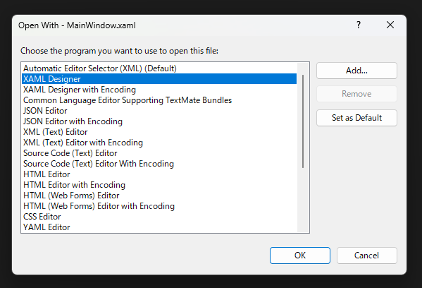
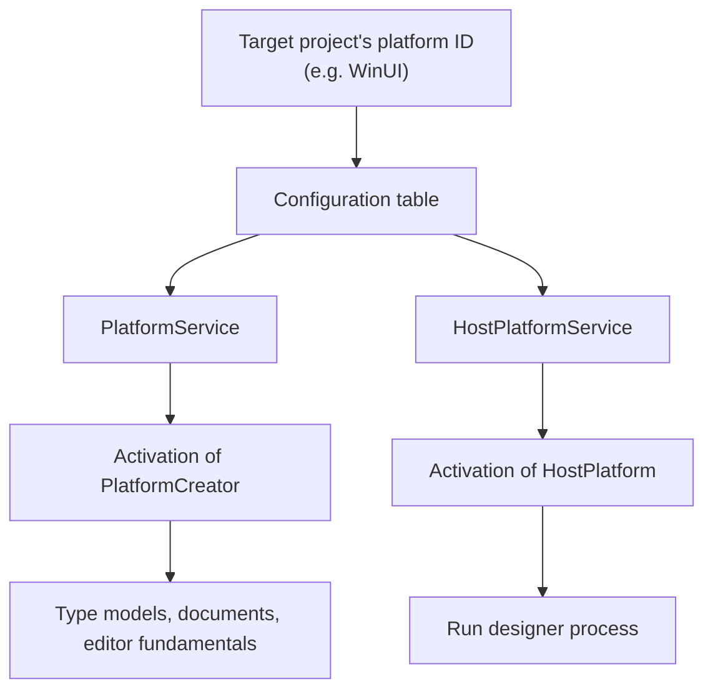

<h1 align="center">WinUI 3 Designer for Visual Studio</h1>
<p align="center">WinUI 3 designer integration for Visual Studio.</p>



## Usage

[](https://marketplace.visualstudio.com/items?itemName=0x5BFA.WinUIDesigner)

Download and open a vsix file from Visual Studio Marketplace. WinUI 3 designer will be automatically available for WinUI 3 projects.

## Structure

**`WinUIDesigner.DiagnosticsTap`**

A native x64 DLL loaded by the isolated WinUI surface process. It attaches to WinUI XAML Diagnostics, exposes property-value-source queries and rendering control to the managed surface, and implements the diagnostics TAP COM entry points.

**`WinUIDesigner.Surface`**

The out-of-process WinUI 3 designer surface, published as the self-contained `WinUISurface.exe`. It connects to Visual Studio through the designer's TAP/pipe contracts, builds and updates the XAML document, and handles designer operations such as selection, hit testing, property values, and layout. It calls `WinUIDesigner.DiagnosticsTap.dll` for native XAML diagnostics that are not exposed by the public WinUI API.

**`WinUIDesigner.Vsix`**

The in-process Visual Studio extension. It registers the WinUI XAML runtime, selects the WinUI platform implementation, reuses Visual Studio's designer host and process-isolation services, stages and launches `WinUISurface.exe`, and provides Toolbox integration and logging.


## Architecture

> [!NOTE]
> Unless otherwise noted, shortened assembly names such as `DesignerHost.dll` refer to the full file name `Microsoft.VisualStudio.DesignTools.DesignerHost.dll`.

### Opening a XAML file

When you open Visual Studio’s **Open With** dialog for a XAML file, it lists two designer-related entries: **XAML Designer** and **XAML Designer with Encoding**. The second entry selects the encoding-aware editor factory.



These entries are registered by `MS.Internal.Package.XamlDesignerPackage` in `XamlDesignerHost.dll` as `TabbedViewEditorFactory` and `TabbedViewCodePageEditorFactory`, respectively. Both implement the Visual Studio SDK interface `IVsEditorFactory`. The package also registers Toolbox providers, which we’ll cover later.

After you select an entry, the Visual Studio shell calls `TabbedEditorFactoryBase.CreateEditorInstance` through `IVsEditorFactory`. The factory checks whether it can reuse an existing document buffer. If not, it calls `XamlTabbedEditorFactoryBase.CreateView` to create a view. `CreateView` delegates to `TabbedViewEditorFactory.DoCreateView`, which reads the project and platform details and determines whether to include the design view.

For WPF and UWP, the built-in platform configuration supports the normal eligibility path, subject to the other designer checks. For WinUI, `DoCreateView` initially disables the design view. It can enable it again when `XamlDesigner\XamlRuntimes\WinUI` contains a valid editor-factory GUID and the default designer-tab factory is registered. That is why this project adds the runtime mapping described in [XAML Designer for WinUI](docs/designer-winui.md).

### Platform registration

Platform configuration supplies the implementation details used to create the designer backend. It is separate from the runtime-to-editor mapping that enables the design tab.

`PlatformConfigurationService` in `DesignerHost.dll` registers configurations for these platforms and targets:

- WPF on .NET Framework
- WPF on .NET Core 3.0 or later
- UWP (`UAP` 0.8 or later)
- Legacy `WindowsXaml80`
- WinUI for desktop .NET (`.NETCoreApp` 5.0 or later)
- WinUI for UAP

These are configuration matching conditions, not a statement of current product support.

For example, the configurations of .NET Framework WPF and WinUI for desktop .NET are registered as follows:

```csharp
RegisterPlatformConfiguration(WpfSpecification, new Dictionary<string, string>
{
    { "PlatformCreatorAssembly", "Microsoft.VisualStudio.DesignTools.WpfSurfaceDesigner" },
    { "PlatformCreatorType", "Microsoft.VisualStudio.DesignTools.WpfSurfaceDesigner.WpfFrameworkPlatformCreator" },
    { "HostPlatformAssembly", "Microsoft.VisualStudio.DesignTools.XamlDesignerHost.dll" },
    { "HostPlatformType", "Microsoft.VisualStudio.DesignTools.WpfDesignerHost.WpfHostPlatform" },
    { "ReferenceAssemblyMode", "TargetFramework" },
    { "PlatformSurfaceIsolatedGuid", "{ABC03A4E-B0A1-41B7-97BA-BB178F354CCD}" },
    { "SupportsToolboxAutoPopulation", "true" },
    { "ToolboxPage", "{7C9BECBA-12B9-4480-9DBF-2345AA3C4F9A}" },
    { "DesignerTechnology", "Microsoft:System.Windows:WPF" },
    { "ClipboardFormat", "CF_WINFX_TOOL" },
    { "ProjectFlavor", "{60dc8134-eba5-43b8-bcc9-bb4bc16c2548}" }
});
```

```c#
RegisterPlatformConfiguration(winuiSpecification, new Dictionary<string, string>
{
    { "DefaultTargetFramework", ".NETCoreApp, Version=5.0" },
    { "SupportsToolboxAutoPopulation", "true" },
    { "SupportsExtensionSdks", "false" },
    { "ToolboxPage", "{8A63BDE2-AEB9-4AF9-A00D-DBC9BD7D509C}" },
    { "DesignerTechnology", "Microsoft:Microsoft.UI.Xaml" },
    { "ClipboardFormat", "CF_WINDOWSUIXAML_TOOL" },
    { "AppPackageType", "WindowsXaml" }
});
```

`PlatformCreatorAssembly` and `PlatformCreatorType` are used together by `PlatformService` to create an `IPlatformCreator`. `HostPlatformAssembly` and `HostPlatformType` are used together by `HostPlatformService` to create an `IHostPlatform`. The built-in WinUI configurations do not specify either pair, so those configurations alone cannot create the WinUI designer backend. The separate `XamlDesigner\XamlRuntimes\WinUI` mapping can still enable the design tab; the creator and host entries are needed to supply its platform implementation. That is why this project updates the platform configuration described in [XAML Designer for WinUI](docs/designer-winui.md).


