<h1 align="center">WinUI 3 Designer for Visual Studio</h1>
<p align="center">WinUI 3 designer integration for Visual Studio.</p>


## Usage

[](https://marketplace.visualstudio.com/items?itemName=0x5BFA.WinUIDesigner)

Download and open a vsix file from Visual Studio Marketplace. WinUI 3 designer will be automatically available for WinUI 3 projects.

## Limitations

- Only C# WinUI projects are supported.
- x86 is not supported.
- `Window` and its subclasses cannot be previewed; only `FrameworkElement` subclasses are supported.
- Windows App SDK 2.5.1 is required.

## Structure

**`WinUIDesigner.DiagnosticsTap`**

A native DLL, packaged for x64 and ARM64, loaded by the isolated WinUI surface process. It attaches to WinUI XAML Diagnostics, exposes property-value-source queries and rendering control to the managed surface, and implements the diagnostics TAP COM entry points.

**`WinUIDesigner.Surface`**

The out-of-process WinUI 3 designer surface, published as the self-contained `WinUISurface.exe`. It connects to Visual Studio through the designer's TAP/pipe contracts, builds and updates the XAML document, and handles designer operations such as selection, hit testing, property values, and layout. It calls `WinUIDesigner.DiagnosticsTap.dll` for native XAML diagnostics that are not exposed by the public WinUI API.

**`WinUIDesigner.Vsix`**

The in-process Visual Studio extension. It registers the WinUI XAML runtime, selects the WinUI platform implementation, reuses Visual Studio's designer host and process-isolation services, stages and launches `WinUISurface.exe`, and provides Toolbox integration and logging.

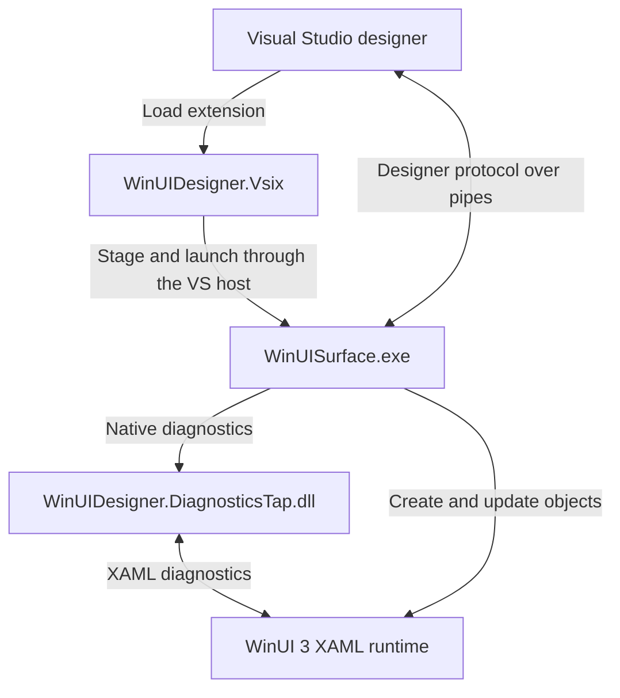

## Architecture

> [!NOTE]
> Unless otherwise noted, shortened assembly names such as `DesignerHost.dll` refer to the full file name `Microsoft.VisualStudio.DesignTools.DesignerHost.dll`.

### Opening a XAML file

When you open Visual Studio’s **Open With** dialog for a XAML file, it lists two designer-related entries: **XAML Designer** and **XAML Designer with Encoding**. The second entry selects the encoding-aware editor factory.


These entries are registered by `MS.Internal.Package.XamlDesignerPackage` in `XamlDesignerHost.dll` as `TabbedViewEditorFactory` and `TabbedViewCodePageEditorFactory`, respectively. Both implement the Visual Studio SDK interface `IVsEditorFactory`. The package also registers Toolbox providers, which we’ll cover later.

After you select an entry, the shell asks its editor factory to open the document. The factory reuses the document's existing text buffer or creates one, then builds a view around it. The project, target platform, and editor settings determine whether that view includes the designer. Source and design views share the same buffer.

WPF and UWP use the normal designer eligibility path. WinUI starts with the design view disabled, but a runtime-specific editor mapping under `XamlDesigner\XamlRuntimes\WinUI` can enable it. The mapping must contain a valid editor-factory GUID, and the built-in designer-tab factory must be registered. Document-specific exclusions can still disable the designer. This project's [runtime registration attribute](src/WinUIDesigner.Vsix/ProvideXamlRuntimeDesignerAttribute.cs) adds the WinUI mapping.

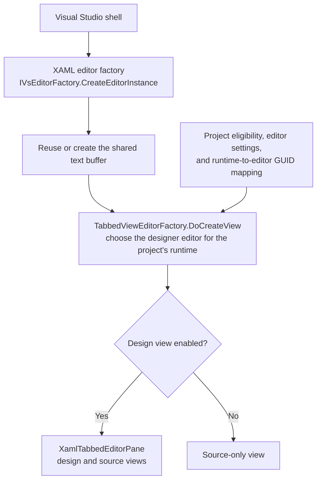

### Creating the designer view

The returned outer pane is a container for the design and source views. The shell first attaches it to a window frame; later display notifications cause it to populate the tabs. Each tab records which editor factory should supply its contents. Creating the container and loading the designer's contents are separate stages.

When the design tab is displayed, it asks the shell to open an inner editor using the selected GUID. The built-in designer-tab factory supplies a `DesignerPane`, which hosts the designer's UI and checks whether the project is supported.

After the compatibility checks pass, the inner pane obtains a `HostDesignerView` and places its UI element in the tab. This wrapper records the source item and text editor. The underlying designer is loaded when the view is needed, including when it becomes visible. The host integration service then obtains the shared designer implementation from `SurfaceDesigner.dll` and asks it to open the document.

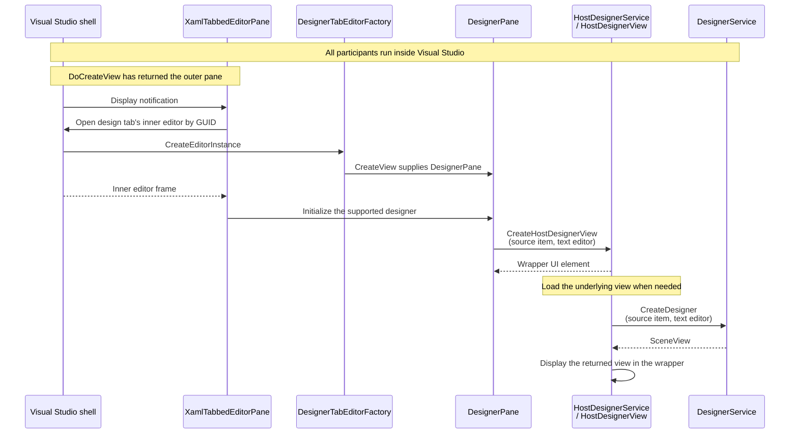

### Platform registration

Platform configuration supplies the implementation details used to create the designer backend. It is separate from the runtime-to-editor mapping that enables the design tab.

`PlatformConfigurationService` in `DesignerHost.dll` registers configurations for these platforms and targets:

- WPF on .NET Framework
- WPF on .NET Core 3.0 or later
- UWP (`UAP` 0.8 or later)
- Legacy `WindowsXaml80`
- WinUI for desktop .NET (`.NETCoreApp` 5.0 or later)
- WinUI for UAP

These are configuration matching conditions, not a statement of current product support.

For example, the configurations of .NET Framework WPF and WinUI for desktop .NET are registered as follows:

```csharp
RegisterPlatformConfiguration(WpfSpecification, new Dictionary<string, string>
{
    { "PlatformCreatorAssembly", "Microsoft.VisualStudio.DesignTools.WpfSurfaceDesigner" },
    { "PlatformCreatorType", "Microsoft.VisualStudio.DesignTools.WpfSurfaceDesigner.WpfFrameworkPlatformCreator" },
    { "HostPlatformAssembly", "Microsoft.VisualStudio.DesignTools.XamlDesignerHost.dll" },
    { "HostPlatformType", "Microsoft.VisualStudio.DesignTools.WpfDesignerHost.WpfHostPlatform" },
    { "ReferenceAssemblyMode", "TargetFramework" },
    { "PlatformSurfaceIsolatedGuid", "{ABC03A4E-B0A1-41B7-97BA-BB178F354CCD}" },
    { "SupportsToolboxAutoPopulation", "true" },
    { "ToolboxPage", "{7C9BECBA-12B9-4480-9DBF-2345AA3C4F9A}" },
    { "DesignerTechnology", "Microsoft:System.Windows:WPF" },
    { "ClipboardFormat", "CF_WINFX_TOOL" },
    { "ProjectFlavor", "{60dc8134-eba5-43b8-bcc9-bb4bc16c2548}" }
});
```

```c#
RegisterPlatformConfiguration(winuiSpecification, new Dictionary<string, string>
{
    { "DefaultTargetFramework", ".NETCoreApp, Version=5.0" },
    { "SupportsToolboxAutoPopulation", "true" },
    { "SupportsExtensionSdks", "false" },
    { "ToolboxPage", "{8A63BDE2-AEB9-4AF9-A00D-DBC9BD7D509C}" },
    { "DesignerTechnology", "Microsoft:Microsoft.UI.Xaml" },
    { "ClipboardFormat", "CF_WINDOWSUIXAML_TOOL" },
    { "AppPackageType", "WindowsXaml" }
});
```

Each configuration associates a target specification with properties describing the designer's editing platform, process host, metadata, and Toolbox behavior. The assembly and type entries identify two implementations: an editing-platform creator and a process host. They are instantiated when requested and cached independently.

The editing service copies the configuration properties when it is constructed. Changes to the configuration table therefore do not automatically update an editing service that already exists. The host service reads the matched configuration when a host is requested and reuses an existing host for the same platform identity.

The built-in WinUI configurations omit both assembly/type pairs. They contain other properties used by designer tools, but do not supply an editing platform or process host. The runtime mapping can still enable a design tab; this project's [platform registration](src/WinUIDesigner.Vsix/WinUIPlatformRegistration.cs) also supplies the missing implementation bindings.

The extension updates the existing desktop WinUI configuration and installs a creator hook that returns its WinUI creator, cached per editing service. This also covers services whose configuration snapshot predates the update. Calls for other XAML runtimes continue through Visual Studio's original implementation. Both the configuration changes and hook follow the extension package's lifetime.

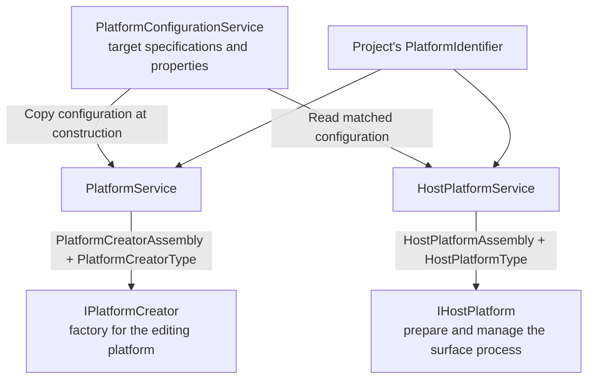

### Connecting the project and host platforms

The shared designer first resolves the source file's project context. An existing context is reused. For a new context, the project's target framework, SDK, and reference assemblies determine the editing platform to create or reuse. That platform supplies the project context, and the manager attaches the corresponding process host to it.

The context retains both references: the editing platform supplies document and scene services, while the host prepares and manages the display process. For UWP, these objects are `UwpProjectContext`, `UwpPlatform`, and `UwpHostPlatform`. WPF uses `WpfProjectContext`, `WpfPlatform`, and `WpfHostPlatform` through the same shared sequence.

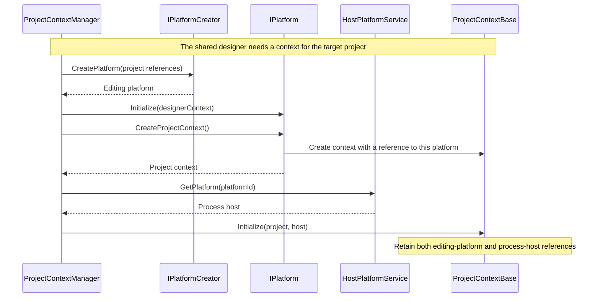

Once the context is available, the shared text buffer is opened as an editing document and parsed into its XAML model. The editing platform supplies a scene view for that document. The view is connected to the text editor and placed inside the wrapper that the design tab already hosts.

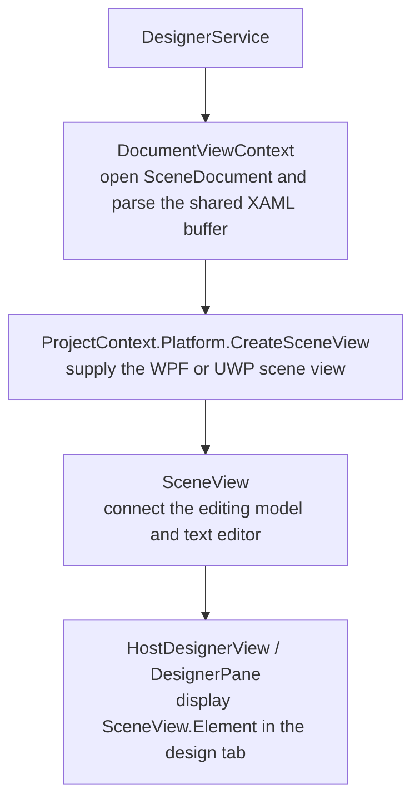

### Starting the isolated process

The scene view belongs to Visual Studio, but the live XAML objects belong to an isolated surface process. This keeps the project's runtime and control instances outside the editor process. When a live display connection is needed, the project context coordinates process startup and the designer's local pipeline.

The host selects the target architecture and runtime, then prepares a shadow cache containing the surface executable, project assemblies, resources, and diagnostics files. The editing platform supplies the markup provider and instance-building components. These components remain inside Visual Studio and connect its editing model to the remote objects.

The launch path depends on the platform:

| Platform | Process preparation and activation |
| --- | --- |
| WPF | Stage the desktop surface and launch it with pipe initialization data. |
| UWP | Prepare and register a designer app package, activate its app view, and initialize its TAP. |
| This WinUI extension | Reuse the WPF .NET host and shadow-copy worker, then launch the extension's WinUI surface. Reuse UWP editing services with WinUI-specific document and display adapters. |

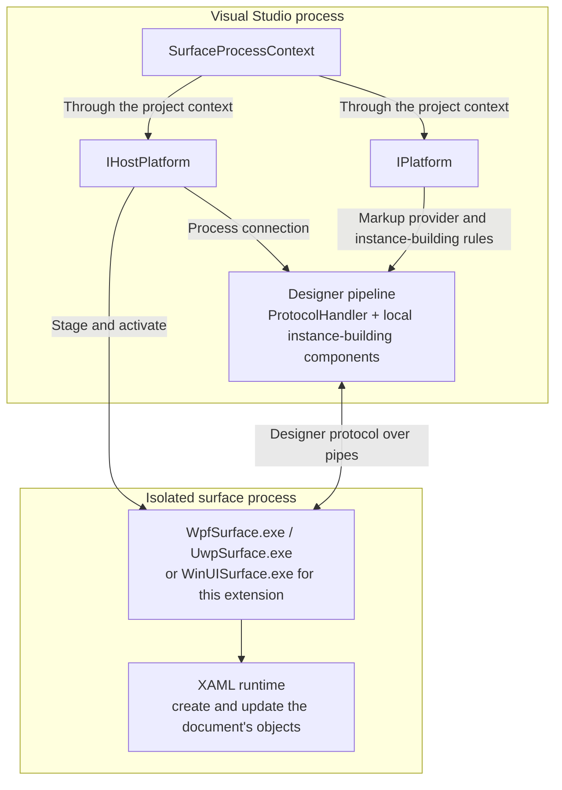

For this extension, the project architecture selects `WinUISurface.x64.exe` or `WinUISurface.arm64.exe`; the selected executable is staged as `WinUISurface.exe`. Project media and library PRI files are also staged for resource lookup. Startup passes the Visual Studio process ID, diagnostics TAP path, pipe initialization data, and DPI context. The surface resolves private designer contracts from the Visual Studio installation that launched it, initializes the WinUI application and dispatcher, registers its services, and starts receiving messages.

Implementation: [process host and staging](src/WinUIDesigner.Vsix/DesignerHost), [local process context](src/WinUIDesigner.Vsix/Platform/WinUISurfaceProcessContext.cs), and [surface startup](src/WinUIDesigner.Surface/Program.cs).

### Communicating with the surface

Two anonymous pipes carry traffic in opposite directions. Their handles must be duplicated or inherited into the receiving process; passing a numeric handle as text alone does not establish a connection. Each side has a protocol handler that sends requests, matches replies to pending requests, and receives notifications.

The wire format is shared with Visual Studio's designer services:

| Part | Format |
| --- | --- |
| Header | Four 32-bit integers: remaining byte length, message type, message ID, and request ID. |
| Request/reply correlation | A reply identifies the original request; common replies use message type `1`. |
| Payload | Data-contract JSON encoded as UTF-16LE, or a contract-specific binary format. |
| Runtime identities | Serialized document IDs and object handles, resolved by the receiving service. |

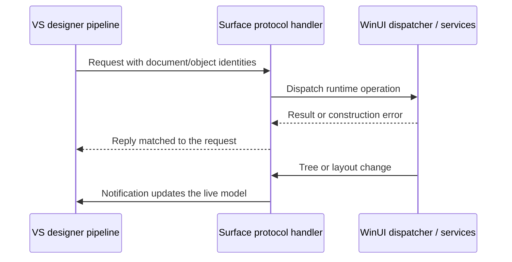

The surface uses the existing private protocol types and adds a pipe bridge compatible with the host's initialization data. Its frame reader assembles complete messages even when reads return partial data. WinUI operations are marshalled to the UI dispatcher; the receive thread does not directly mutate XAML objects. Service observers are registered before protocol startup so an early request can be handled.

Implementation: [pipe bridge](src/WinUIDesigner.Surface/SurfacePipeDataBridge.cs), [frame reader](src/WinUIDesigner.Surface/MessageFrameReader.cs), and [service initialization](src/WinUIDesigner.Surface/SurfaceApplication.cs).

### Loading the XAML document

Visual Studio prepares a design-time representation of the editing document. It can send XAML to load or construction actions describing objects, properties, and collection contents. Application resources and design-time resources are separate documents included with the edited document.

The surface first prepares those resources, then constructs the edited document on its UI thread. When XAML loading fails and actions were not supplied, it asks Visual Studio for construction actions. This alternative also lets the designer build objects individually and associate failures with the editing model.

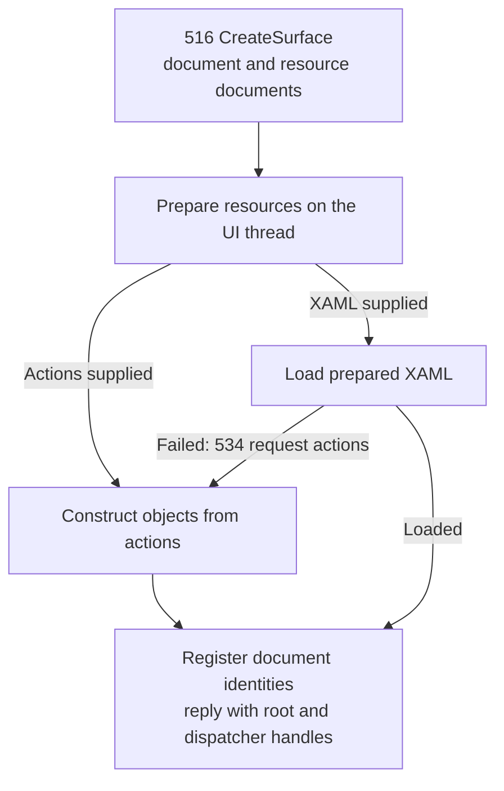

In this extension, the markup provider prepares App.xaml and design-time resources without using the application's compiled App XBF. The instance manager also sends preview configuration for `XamlControlsResources` and the requested theme. The surface loads prepared XAML with WinUI's XAML reader or executes construction actions through its action service. Staged project assemblies, XAML metadata providers, and PRI files supply custom types and resources.

The surface records stable runtime identities and source information, and reports visual-tree changes to Visual Studio. The returned root handle identifies an object; it is separate from the window used to display it. A successful construction reply therefore completes document creation, while embedding happens in the next stage.

Implementation: [document preparation](src/WinUIDesigner.Vsix/Platform/WinUIDesignerInstanceManager.cs), [construction and tree notifications](src/WinUIDesigner.Surface/Services/SurfaceService.cs), and [project type/resource resolution](src/WinUIDesigner.Surface/ProjectRuntimeResolver.cs).

### Embedding the surface

Visual Studio supplies the artboard, selection adorners, and editing tools. The isolated process supplies the rendered XAML content. The scene view must connect that content to the artboard and keep the display coordinates aligned with the editing tools.

| Platform | Display connection |
| --- | --- |
| WPF | Attach the remote surface's child HWND to the designer's holder window. |
| UWP | Obtain the app view's visual and connect it to a DirectComposition target in Visual Studio. |
| This WinUI extension | Host the document in `DesktopWindowXamlSource` and attach its window beneath the designer's overlay. |

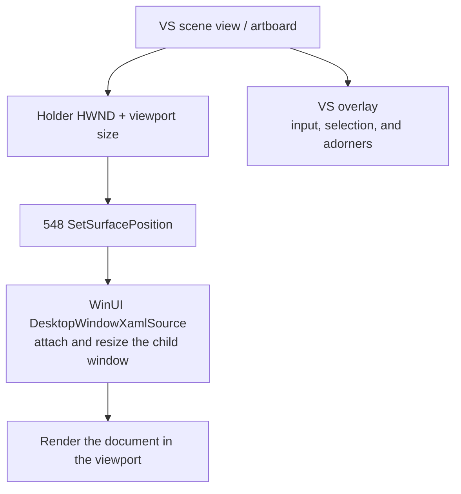

The WinUI scene adapter replaces UWP's image host while retaining the shared artboard and tools. It sends the holder window and viewport dimensions after the document exists. The surface creates its XAML island, reparents the window, and keeps it below the overlay. The adapter forwards overlay input to the designer's tools.

Viewport size, preview device size, and pan/zoom are separate values. The viewport clips the visible area, device size controls the document's layout, and pan/zoom transforms its content. Keeping these separate allows the overlay, runtime bounds, and hit-test coordinates to agree as the user scrolls or zooms. Layout, bounds, and DPI notifications update the frontend's live view of the surface.

Implementation: [scene and window adapter](src/WinUIDesigner.Vsix/Platform/WinUISceneView.cs), [overlay placement](src/WinUIDesigner.Vsix/Platform/WinUIOverlayWindow.cs), and [WinUI island](src/WinUIDesigner.Surface/Services/DesignerSurface.cs).

### Handling designer operations

The designer's tools run inside Visual Studio. They turn pointer input into selection, insertion, movement, and resizing of editing-model nodes. The surface answers questions about the live objects and applies the resulting runtime changes. Object handles and source information connect the editing nodes to those objects. The live visual tree also contains template-generated children beyond the nodes explicitly authored in XAML.

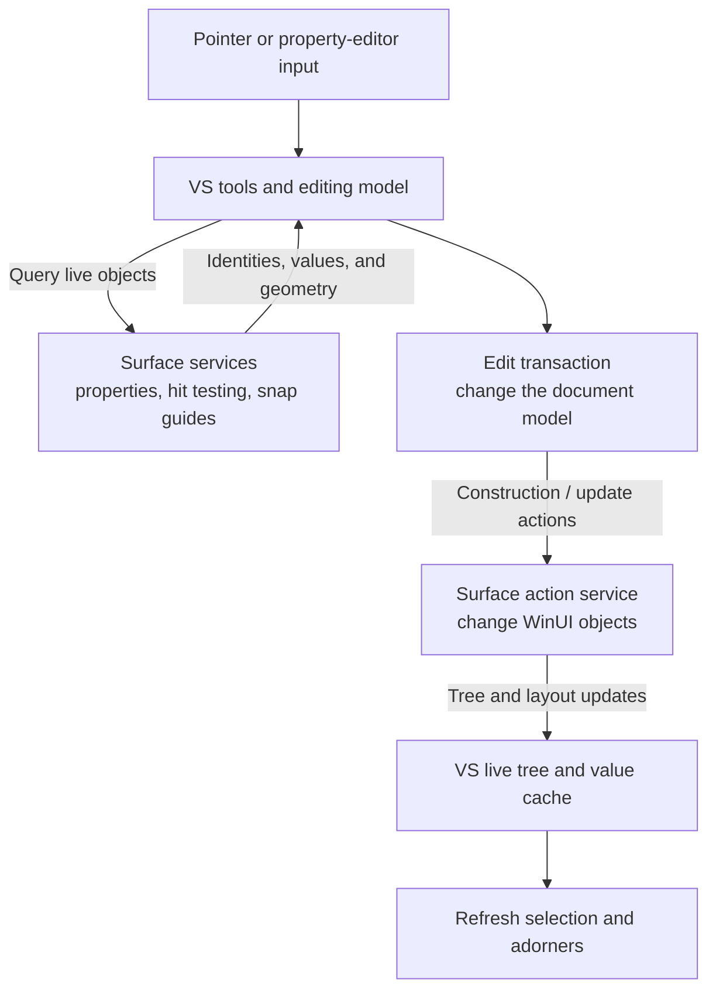

The surface implements these operation groups:

| Operation | Runtime work |
| --- | --- |
| Property queries | Return live values, base/current values, value sources, and layout information. |
| Hit testing | Find live elements at a point or within a rectangle and return their identities. |
| Snapping | Return container-relative edges, centers, and supported text baselines. |
| Model changes | Create objects, set or clear properties, edit collections and dictionaries, and update names and resource relationships. |
| State and animation preview | Apply visual states and control storyboards on the UI thread. |

Property origins matter to the editing model: a default, local value, or style value can require a different edit. The native diagnostics helper supplies value-source information unavailable through the public WinUI property API. When diagnostics are unavailable, the property service falls back to inspecting local values and explicit style setters. Preview-only dimensions are kept separately from authored dimensions so the preview does not write its device size into XAML.

During a drag, the shared designer updates temporary edits and commits or cancels the final transaction. Its pipeline invalidates cached live values after processing changes and uses runtime geometry to refresh adorners. Rendering can also be suspended while related changes are applied; that suspension is separate from the editing transaction and cache invalidation.

Implementation: [surface services](src/WinUIDesigner.Surface/Services), [object identities](src/WinUIDesigner.Surface/Services/ObjectIdentityRegistry.cs), and [native diagnostics](src/WinUIDesigner.DiagnosticsTap/DiagnosticsTap.cpp). The action service reports unsupported actions as errors; this implementation does not imply complete parity with every built-in designer operation.

### Synchronizing XAML and design changes

The shared text buffer and Visual Studio's XAML document model are the editing state. The surface holds the live preview of that model. Text edits are parsed into document changes, which the designer pipeline applies to the runtime tree. Design edits change the same document model through editing transactions, and the language service writes those changes back into the shared buffer.

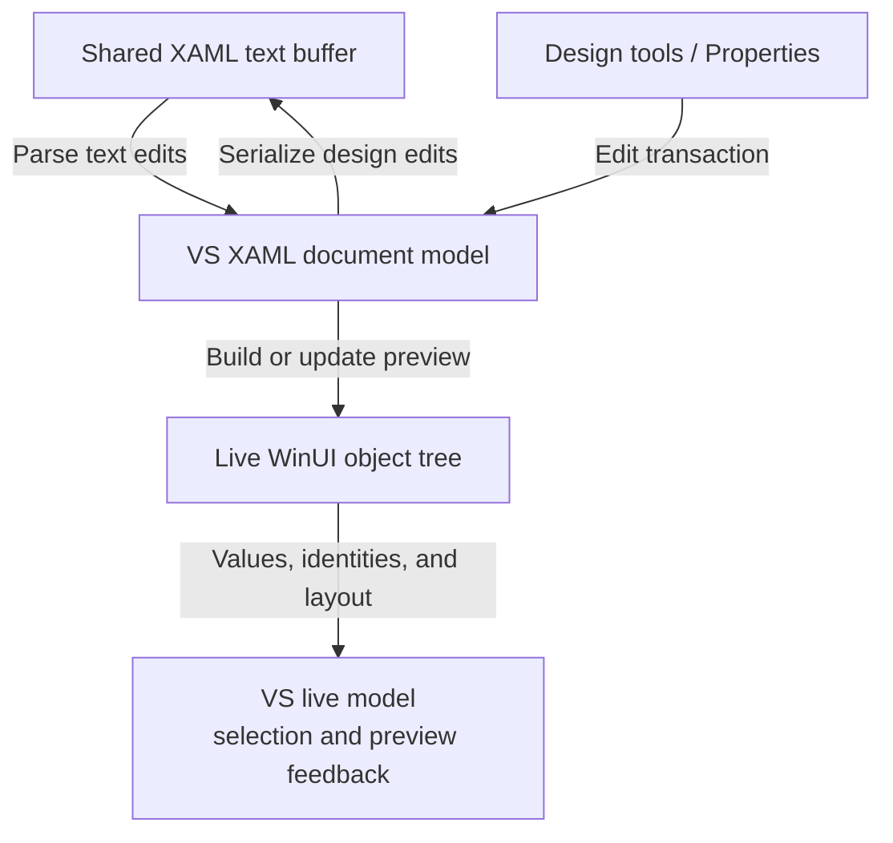

For design edits, the language service first attempts incremental serialization. Changes that cannot be serialized incrementally cause the document to be serialized as a whole. The serializer handles namespace declarations, markup extensions, property elements, and collection content; text edits are formatted and committed through the shared editor integration.

Parsing and serialization have guards against feeding their own changes back into another edit. Hidden design-time properties are also excluded from normal serialization. Undo and redo use the shared designer and editor history, with corresponding runtime changes processed by the instance pipeline. Runtime notifications refresh the live model; they do not independently save the XAML file.

This extension reuses that frontend synchronization. Its responsibility is to preserve the document/object correspondence while applying action batches in order, then report the surviving visual tree and layout. Removing a visual does not immediately invalidate every object handle: an undo operation may reconnect an existing object before the document is closed.

Implementation: [ordered action execution](src/WinUIDesigner.Surface/Services/XamlActionService.cs), [document ownership](src/WinUIDesigner.Surface/Services/ObjectIdentityRegistry.cs), and [tree/layout publication](src/WinUIDesigner.Surface/Services/SurfaceService.cs). Text parsing and serialization themselves are provided by Visual Studio's `Markup.dll` and XAML language service.

### Toolbox integration

Toolbox integration has three entry points. Static registration supplies standard controls, discovery supplies selectable types from assemblies, and automatic population watches project or package references. The configuration flag enabling automatic population does not itself discover controls.

| Entry point | This extension's implementation |
| --- | --- |
| Standard controls | Register a WinUI 3 group and provide encoded item content through the package's Toolbox provider. |
| Choose Items | Register WinUI discovery, item creation, and an isolated metadata AppDomain. Accept eligible public, non-abstract controls with a public parameterless constructor. |
| Automatic population | Reuse the available VS infrastructure; complete WinUI project/NuGet discovery is not supplied by the above registrations. |

The inspected VS automatic project source recognizes WPF and UWP base types, but does not list `Microsoft.UI.Xaml.FrameworkElement`. Consequently, the WinUI configuration's automatic-population flag cannot be taken as proof that every project control will appear. The extension supplies standard controls explicitly and a separate WinUI Choose Items discovery path.

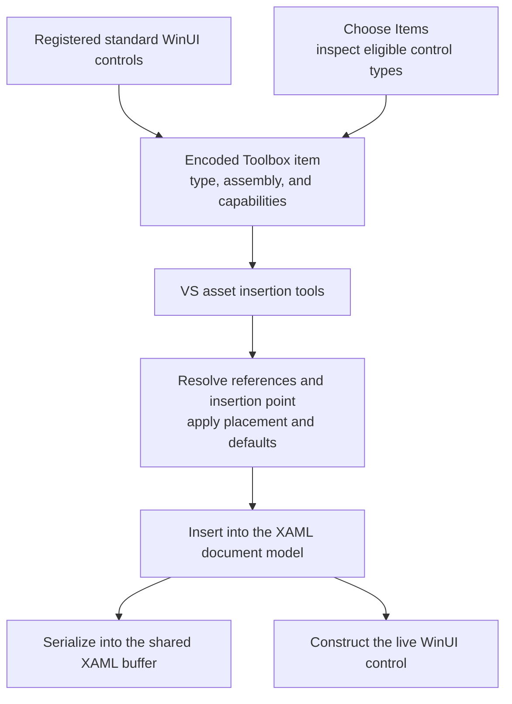

A Toolbox item describes a type to create; it does not carry an already-created WinUI control into Visual Studio. The extension encodes the shared XAML Toolbox format and adds WinUI capability information. On insertion, the shared tools resolve required references, select a valid destination, and apply placement and default values through the document model. The ordinary text/runtime synchronization then handles the new control.

The preferred Choose Items page identifies the registered discovery provider. It is separate from the Toolbox group containing the controls. The metadata AppDomain used for discovery is also separate from the process that renders the document.

Implementation: [Toolbox providers and registration](src/WinUIDesigner.Vsix/Toolbox) and [package registration](src/WinUIDesigner.Vsix/WinUIDesignerPackage.cs).

### Error handling and lifetime management

Failures can occur before the surface starts, while the connection initializes, during document construction, or after the preview is displayed. A created tab, running executable, or successful construction reply proves only that particular stage completed.

| Stage | Failure handling in this extension |
| --- | --- |
| Platform and staging | Reject missing private contracts, unsupported project/runtime architectures, missing payloads, and detected WinUI runtime version mismatches. |
| Startup and communication | Log startup exceptions and child-process exits; bound frame sizes and fail incomplete messages. |
| Document construction | Attempt the action-based loading alternative, then return construction failure information and publish error notifications. |
| Runtime operations | Return contract-specific failure results or notifications; dispatcher work observes cancellation and timeouts. |
| Shutdown | Cancel pending protocol work, release document services and native windows, and dispose the connection. |

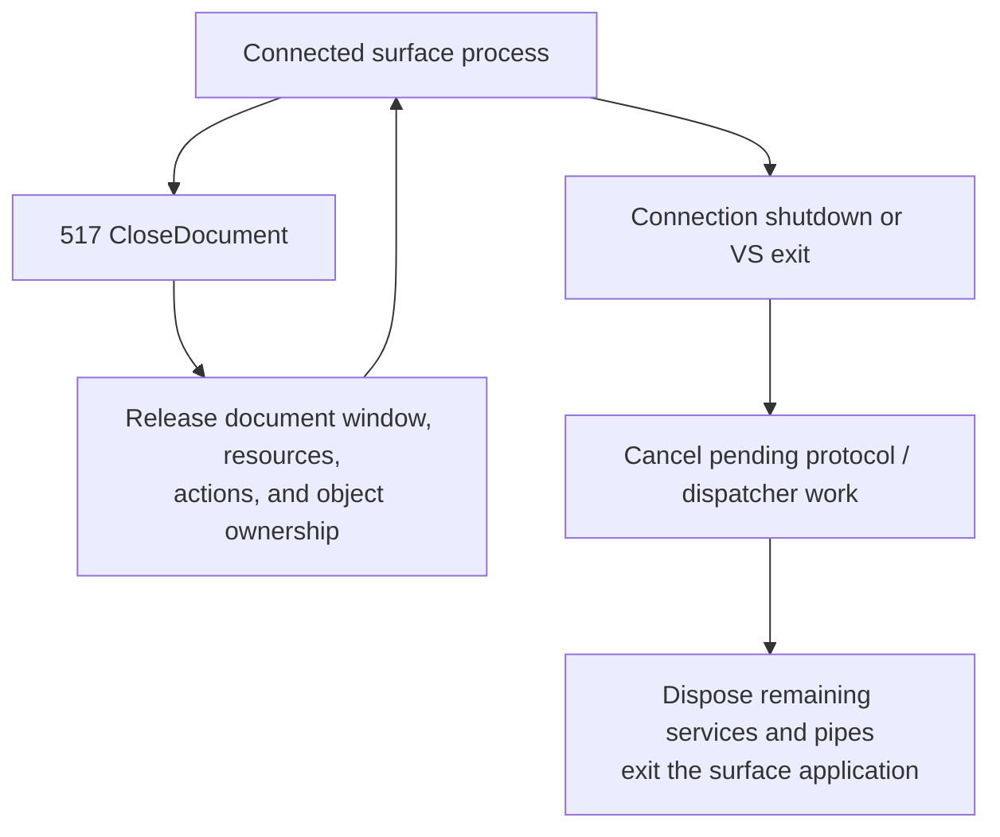

Closing a document releases its surface and document-owned state. Resources shared with another document are retained until their remaining owners are released. Document closure and process shutdown are separate lifetimes; the connection can serve more than one document.

The surface watches the Visual Studio process and exits when its host disappears or the protocol shuts down. On disposal, it shuts down protocol work before releasing its services and pipes. The extension package also restores the platform configuration entries and removes its creator hook when disposed.
